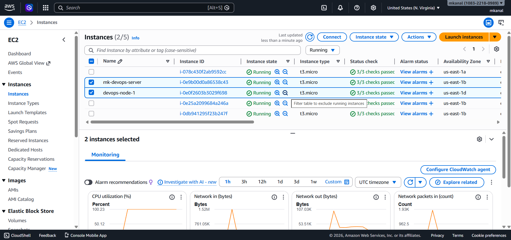
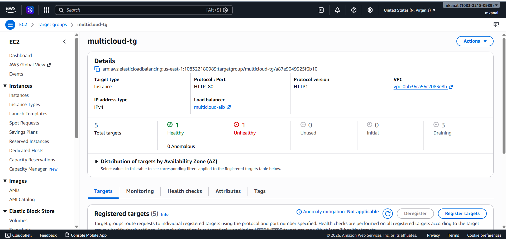
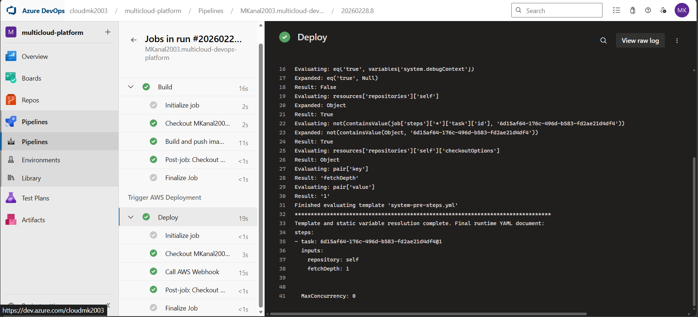
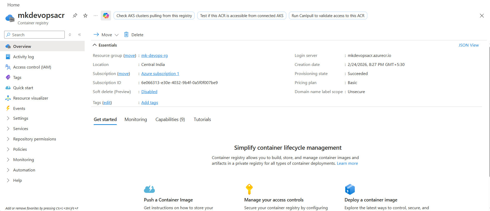
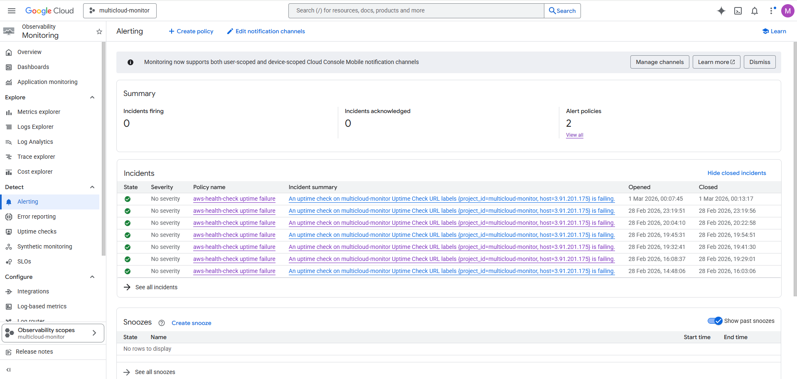
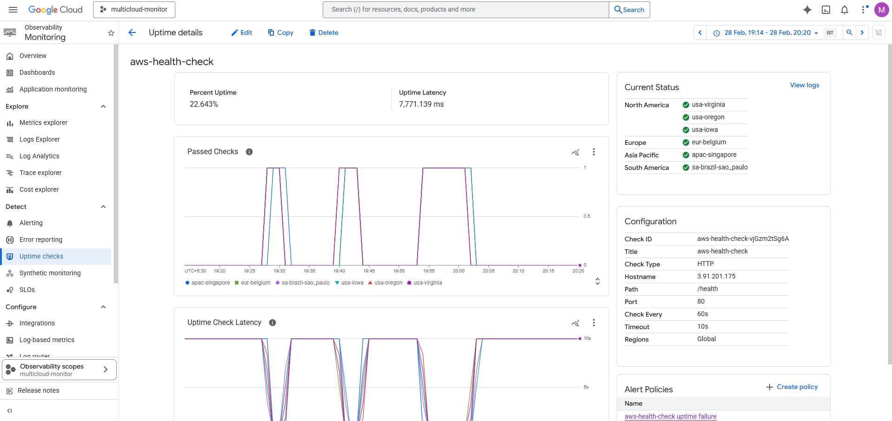

# multicloud-devops-platform
# Multi-Cloud Self-Healing DevOps Platform 🚀

## Overview

This project demonstrates a real-world production DevOps architecture built across **AWS, Azure, and Google Cloud**.
The platform automatically builds, deploys, monitors, heals, and scales a containerized application without manual intervention.

The goal of this project is to simulate how modern product companies operate cloud infrastructure using CI/CD, monitoring, and auto-scaling.

---

## Architecture

**Flow:**

GitHub → Azure DevOps → Azure Container Registry → AWS EC2 → AWS Load Balancer → Users
↑
Google Cloud Monitoring (Auto-Healing)

---

## Technologies Used

### Cloud Providers

* AWS (EC2, Load Balancer, Auto Scaling Group)
* Azure (Azure DevOps Pipelines, Container Registry)
* Google Cloud (Uptime Monitoring & Alerting)

### DevOps Tools

* Docker
* Watchtower (auto container updates)
* Webhooks
* CI/CD Pipelines
* Health Checks

### Concepts Implemented

* Continuous Integration
* Continuous Deployment
* Self-Healing Infrastructure
* High Availability
* Load Balancing
* Rolling Updates
* Auto Scaling
* Monitoring & Alerting

---

## Key Features

### 1. Automated CI/CD

* Developer pushes code to GitHub
* Azure DevOps builds Docker image
* Image pushed to Azure Container Registry
* AWS servers automatically deploy latest version

### 2. Self-Healing

* Google Cloud continuously monitors `/health`
* If server/container crashes:

  * GCP triggers webhook
  * AWS redeploys container automatically

### 3. High Availability

* Application runs on multiple AWS EC2 instances
* AWS Load Balancer distributes traffic
* Failure of one server does not affect users

### 4. Auto Scaling

* Based on CPU usage
* AWS automatically creates new servers during heavy traffic
* Removes servers when traffic drops

---

## Health Endpoints

* `/health` → Liveness check
* `/ready` → Readiness check (for zero-downtime deployments)

---

## What Makes This Project Unique

Unlike basic DevOps demos, this project:

* Uses **three cloud providers together**
* Implements **self-healing**
* Demonstrates **real SRE concepts**
* Supports **zero-downtime deployment**
* Automatically scales infrastructure

---

## Author

**Mallikarjuna Kanal**
DevOps Engineer | Cloud & Automation Enthusiast

## Project Demonstration

### Live Application

### Auto Scaling (AWS EC2)

### Load Balancer Health

### CI/CD Pipeline (Azure DevOps)

### Container Registry (ACR)

### Monitoring & Auto-Healing (GCP)

### Uptime Monitoring

